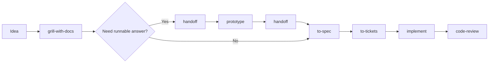

# Getting started

Skills are markdown instructions an agent loads when a task matches their description. This repo is AI-agnostic: the same skills can be installed into any harness supported by the `skills` installer, or linked locally for development.

## Install with skills.sh

```bash
npx skills@latest add maccalsa/skills
```

Pick the skills and target agents you want. Install `/setup-agent-skills` if you plan to use engineering flows that read or write issues, triage labels, `CONTEXT.md`, or ADRs.

Install or update a single skill:

```bash
npx skills@latest add maccalsa/skills --skill=tdd
npx skills update tdd
```

## Local checkout workflow

If you maintain this repo locally, link active skills into common local agent directories:

```bash
cd ~/dev/skills
./scripts/link-skills.sh
```

By default this links into `~/.claude/skills` and `~/.agents/skills`. To target another directory, set `SKILLS_DESTS` to a colon-separated list:

```bash
SKILLS_DESTS="$HOME/.cursor/skills:$HOME/.agents/skills" ./scripts/link-skills.sh
```

## Replacing an old Cursor checkout

If the old repo is checked out at `~/.cursor/skilss` or `~/.cursor/skills`, remove or move that checkout first, then use the installer or link script:

```bash
mv ~/.cursor/skilss ~/.cursor/skilss.backup 2>/dev/null || true
mv ~/.cursor/skills ~/.cursor/skills.backup 2>/dev/null || true
npx skills@latest add maccalsa/skills
```

For local development instead of installer-managed copies:

```bash
git clone https://github.com/maccalsa/skills ~/dev/skills
cd ~/dev/skills
SKILLS_DESTS="$HOME/.cursor/skills" ./scripts/link-skills.sh
```

## Recommended flow



Run `/ask-skills` when you are unsure which route fits.
