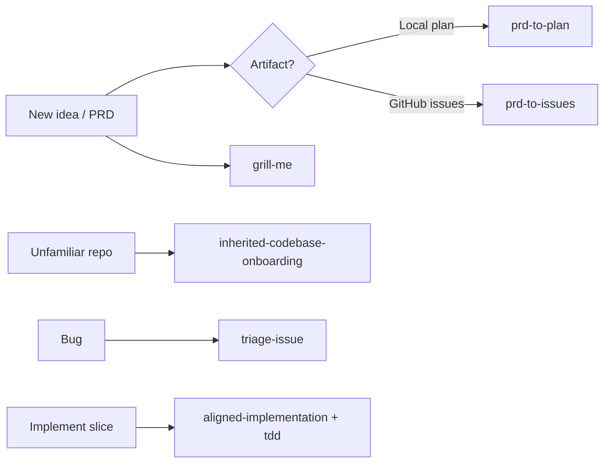

# Getting started

Skills are **markdown instructions** the agent reads when your task matches their description. They keep behavior consistent: when to align, when to test, when to file issues, and what *not* to do.

## Where skills live

- **In Cursor:** `.cursor/skills/<name>/SKILL.md`, `skills/<name>/`, or paths you configure.
- **On this site:** Browse the [Skills catalog](skills/index.md)—each skill has its own page under **Skills** in the sidebar.

## How to invoke a skill

Use an **`@mention`** in chat so the agent loads the right skill **before** writing code or tests.

!!! example "Minimal pattern"
    ```text
    @tdd — Public API: createCheckout(cart). First behavior: happy path succeeds.
    ```

    The agent should confirm the behavior list, then write **one failing test**, then minimal code.

## Choose a workflow



- **Product clarity:** [grill-me](skills/grill-me.md), [prd-critique](skills/prd-critique.md)
- **Plan or tickets:** [prd-to-plan](skills/prd-to-plan.md), [prd-to-issues](skills/prd-to-issues.md)
- **Orientation:** [inherited-codebase-onboarding](skills/inherited-codebase-onboarding.md)
- **Shipping a slice:** [aligned-implementation](skills/aligned-implementation.md) + [tdd](skills/tdd.md)
- **GitHub:** [issue-to-pr](skills/issue-to-pr.md) after your branch is ready

## Rules that work well

1. **One anchor per thread** — issue number, plan section, or pasted scope block; avoid mixing unrelated features.
2. **Approve before RED** — for `aligned-implementation` and `tdd`, settle the public API and “done for this thread” before the first failing test.
3. **Vertical slices** — each PR or thread should deliver something end-to-end and demoable, not “all models then all controllers.”
4. **Escalate with the right skill** — tangled code → [improve-codebase-architecture](skills/improve-codebase-architecture.md) or [request-refactor-plan](skills/request-refactor-plan.md); Neon egress → [neon-postgres-egress-optimizer](skills/neon-postgres-egress-optimizer.md).

## Next steps

- Open the [Skills catalog](skills/index.md) and jump to the pages you reuse most.
- Walk the [calendar refresh recipe](recipes/end-to-end-flow.md) to see skills in sequence.
- Copy from [Cookbook: quick examples](cookbook/quick-examples.md).
